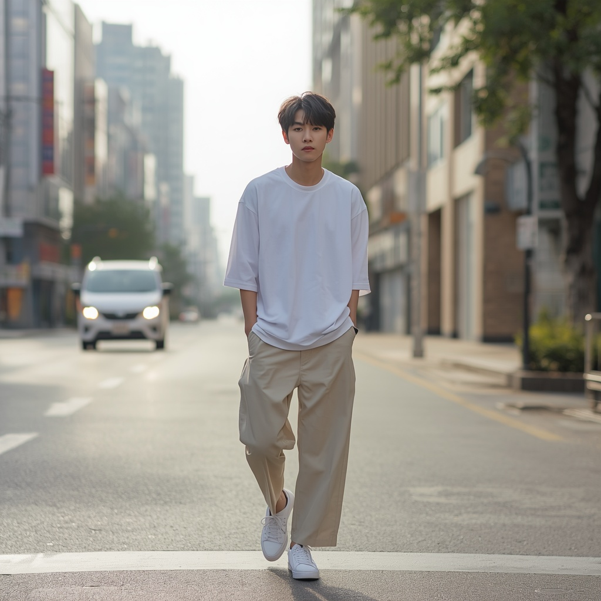
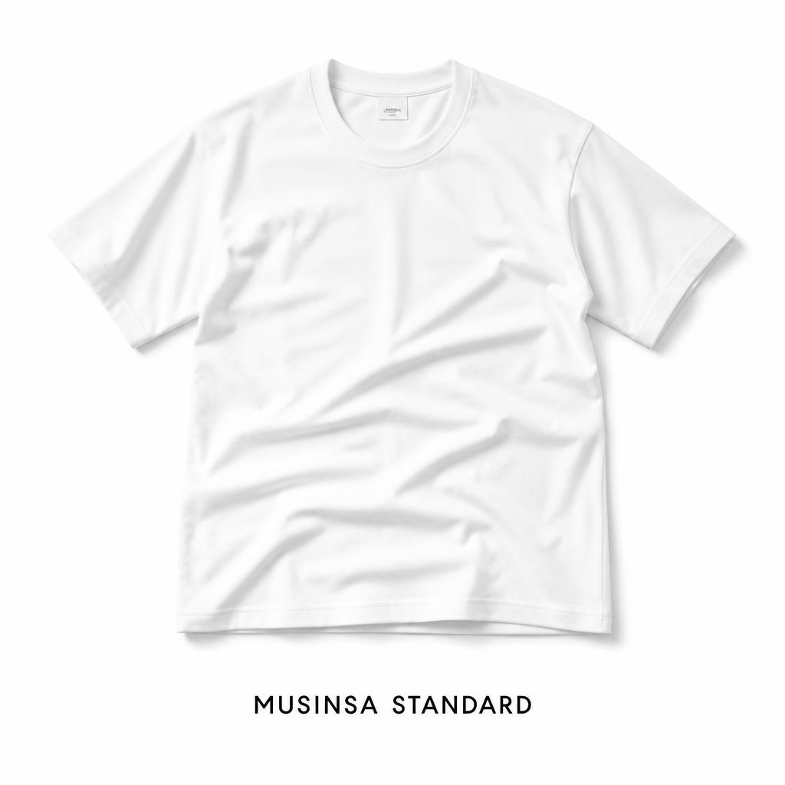

# 🎬 무신사 스탠다드 AI 광고 영상 제작 프로젝트

> AI 도구를 활용하여 실제 브랜드 **무신사 스탠다드**의 광고 영상을 기획부터 제작까지 완성한 프로젝트입니다.

---

## 📁 목차

- [프로젝트 개요](#-프로젝트-개요)
- [스토리보드 기획서](#-스토리보드-기획서)
- [과제 목표 달성 내용](#-과제-목표-달성-내용)
- [기능 요구사항 충족 현황](#-기능-요구사항-충족-현황)
- [사용 도구 스택](#-사용-도구-스택)
- [프롬프트 전략](#-프롬프트-전략)
- [산출물 목록](#-산출물-목록)

---

## 📌 프로젝트 개요

| 항목 | 내용 |
|------|------|
| **프로젝트명** | 무신사 스탠다드 AI 광고 영상 제작 |
| **브랜드** | 무신사 스탠다드 (MUSINSA STANDARD) |
| **제작 방식** | AI 이미지 생성 → AI 영상 변환 |
| **총 영상 길이** | 12초 (씬 1: 6초 + 씬 2: 6초) |
| **광고 컨셉** | 일상 속 자연스러운 미니멀 스타일 |
| **타겟** | 20대 남성 |

---

## 🎨 스토리보드 기획서

### 광고 컨셉

```
"일상 속 자연스러운 스타일"

무신사 스탠다드의 핵심 가치인 '누구나 입을 수 있는 기본템'을
도시 일상 배경으로 자연스럽게 표현합니다.
```

### 비주얼 방향성

| 항목 | 내용 |
|------|------|
| **색감** | 화이트, 베이지, 그레이 톤 |
| **분위기** | 미니멀, 시네마틱 |
| **메시지** | 심플하지만 완성된 스타일 |

---

### 🎞️ 씬 구성표

| 구분 | 씬 1 | 씬 2 |
|------|------|------|
| **시간** | 0 ~ 6초 | 6 ~ 12초 |
| **장면** | 남성 모델 도심 워킹샷 | 흰 티셔츠 제품 + 브랜드명 |
| **의상** | 흰 오버핏 티 + 베이지 와이드팬츠 + 흰 스니커즈 | 흰 오버핏 티셔츠 단독 |
| **배경** | 도심 도로, 안개낀 빌딩 | 순백색 미니멀 배경 |
| **카메라** | 정면 워킹샷, 자연스러운 움직임 | 슬로우 줌인, 제품 클로즈업 |
| **분위기** | 자연스럽고 일상적인 무드 | 깔끔하고 미니멀한 무드 |
| **텍스트** | 없음 | `MUSINSA STANDARD` |

---

### 🖼️ 생성 이미지 미리보기

**씬 1 - 모델 착용샷**



**씬 2 - 제품 단독샷**



---

### 📐 기술 스펙

| 항목 | 이미지 | 영상 |
|------|--------|------|
| **도구** | Leonardo.ai (GPT Image 2) | Hailuo 2.3 |
| **해상도** | 1024 × 1024 | 1376 × 768 (768p) |
| **설정** | Dynamic / Low | - |
| **길이** | - | 씬당 6초 / 총 12초 |

---

## ✅ 과제 목표 달성 내용

### 1. 브랜드 아이덴티티 반영
- 무신사 스탠다드의 핵심 컨셉 **"미니멀 베이직"** 을 영상으로 표현
- 화이트 + 베이지 컬러톤으로 브랜드 무드 일관성 유지
- 모델 착용샷(씬 1) + 제품 단독샷(씬 2) 구성으로 실제 광고 포맷 구현

### 2. AI 이미지 생성
- **도구:** Leonardo.ai (GPT Image 2)
- **설정:** 1024×1024 / Dynamic / Low
- 씬 1: 도심 거리를 걷는 남성 모델 착용샷 생성
- 씬 2: 흰 티셔츠 제품 + `MUSINSA STANDARD` 텍스트 포함 이미지 생성

### 3. AI 영상 변환
- **도구:** Hailuo 2.3
- **스펙:** 1376×768 (768p)
- 생성된 이미지 2장을 각각 영상으로 변환
- 씬 1: 자연스러운 워킹 무브먼트 표현
- 씬 2: 슬로우 줌인으로 제품 집중 연출

### 4. 최종 광고 영상 완성
- 총 길이 **12초** (씬 1 + 씬 2 각 6초)
- 브랜드명 `MUSINSA STANDARD` 텍스트 포함 엔딩 씬 구성
- 일관된 미니멀 무드로 광고 완성도 확보

---

## 📋 기능 요구사항 충족 현황

| 요구사항 | 충족 여부 | 세부 내용 |
|---------|:---------:|---------|
| AI 이미지 생성 | ✅ | Leonardo.ai GPT Image 2 활용, 2장 생성 |
| AI 영상 생성 | ✅ | Hailuo 2.3 활용, 이미지 → 영상 변환 |
| 브랜드 컨셉 반영 | ✅ | 미니멀 베이직 무드, 화이트/베이지 톤 구현 |
| 스토리보드 작성 | ✅ | 2씬 구성 기획 문서 완성 |
| 영상 길이 기준 충족 | ✅ | 총 12초 (씬당 6초) |
| 영상 해상도 | ✅ | 768p (1376×768) |
| 브랜드명 노출 | ✅ | 씬 2 이미지에 MUSINSA STANDARD 텍스트 삽입 |

---

## 🛠️ 사용 도구 스택

| 도구 | 버전 / 설정 | 용도 |
|------|------------|------|
| **Leonardo.ai** | GPT Image 2 / Dynamic / Low | AI 이미지 생성 |
| **Hailuo** | 2.3 | 이미지 → 영상 변환 |
| **TTS Maker** |  | 음성 나레이션 생성 |

---

## 💡 프롬프트 전략

### 씬 1 - 이미지 프롬프트

```
Korean young male model,
white oversized t-shirt, beige wide pants, white sneakers,
walking on urban street, cinematic, natural lighting,
full body shot, minimal style, foggy city background
```

> **의도:** 무신사 스탠다드의 일상적이고 자연스러운 스타일링을 도심 배경으로 표현.
> 안개낀 도시 분위기로 시네마틱한 무드 연출.

---

### 씬 2 - 이미지 프롬프트

```
white oversized t-shirt flat lay,
pure white background, minimal,
brand name "MUSINSA STANDARD" text below,
clean product shot, studio lighting, soft shadow
```

> **의도:** 제품 자체의 깔끔함을 강조하는 미니멀 제품 컷.
> 브랜드명을 하단에 배치해 광고 엔딩 씬으로 활용.

---

### 씬 1 - 영상 변환 프롬프트 (Hailuo 2.3)

```
person walking slowly forward,
cinematic camera movement, smooth natural motion,
minimal style, soft lighting
```

### 씬 2 - 영상 변환 프롬프트 (Hailuo 2.3)

```
slow zoom in on white clothing,
soft light, clean white background,
cinematic product shot, minimal
```

---

## 📁 산출물 목록

```
📂 AI 도구 학습 B1-2/               
├── 📄 main.md                  ← 프로젝트 설명 (현재 파일)
├── 📄 storyboard.pdf             ← 스토리보드 기획 문서
├── 🖼️ scene1.png                ← 씬 1 AI 생성 이미지
├── 🖼️ scene2.png                ← 씬 2 AI 생성 이미지
├── 🎬 scene1.mp4                 ← 씬 1 영상 (0~6초)
├── 🎬 scene2.mp4                 ← 씬 2 영상 (6~12초)
```

---

## 🗓️ 제작 과정 요약

```
STEP 1  이미지 생성    Leonardo.ai (GPT Image 2)로 씬 1, 씬 2 이미지 생성
   ↓
STEP 2  영상 변환      Hailuo 2.3으로 이미지 → 영상 변환 (각 6초)
   ↓
STEP 3  최종 완성      씬 1 + 씬 2 합쳐 총 12초 광고 영상 완성
```

---

<div align="center">

**MUSINSA STANDARD**
*Simple. Essential. Everyday.*

</div>
