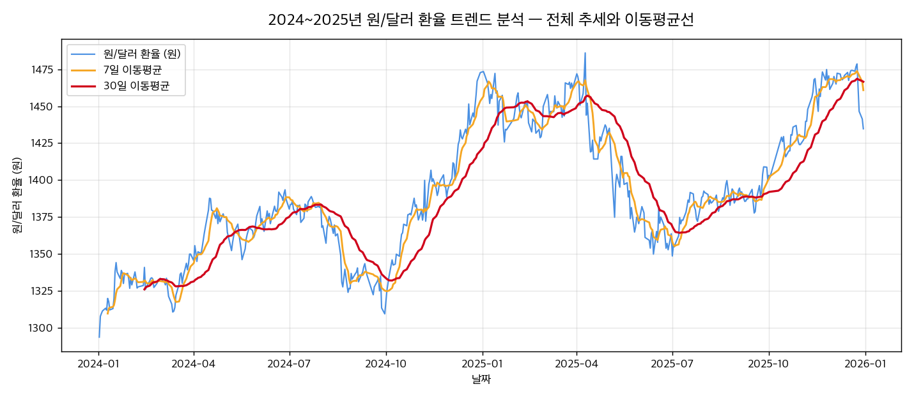

# 2024~2025년 원/달러 환율 트렌드 분석

> 2024~2025년 원/달러 환율(KRW=X) 시계열 데이터 기반 트렌드 분석 프로젝트입니다.



## 📌 프로젝트 요약
- **분석 대상**: 2024~2025년 원/달러 환율 트렌드 분석
- **데이터 기간**: 2024-01-02 ~ 2025-12-30 (총 486개)
- **핵심 지표**: 전체 변화율 +10.91%, 일간 변동성 0.61%, 최고점 1,486.13 (2025-04-09), 최저점 1,293.54 (2024-01-02)
- **상세 분석 보고서**: 👉 [REPORT.md](REPORT.md) 에서 확인하실 수 있습니다.

## 📂 폴더 구조
```
usdkrw-exchange-rate-analysis/
├── data/                        # 원본 데이터 스냅샷
│   └── usdkrw-exchange-rate-analysis.csv
├── images/                      # 분석 시각화 결과물 (PNG)
│   ├── 01_trend_moving_average.png
│   ├── 02_return_volatility.png
│   ├── 03_monthly_return.png
│   ├── 04_cumulative_weekday.png
│   ├── 05_distribution.png
│   ├── 06_heatmap.png
│   ├── bonus_decomposition.png
│   └── bonus_prediction.png
├── analysis.py                  # 분석 및 시각화 재현 스크립트
├── REPORT.md                    # 최종 분석 리포트 본문
├── requirements.txt             # 의존성 패키지 목록
└── README.md                    # 프로젝트 안내
```

## 🚀 실행 방법 (재현성)
```bash
pip install -r requirements.txt
python analysis.py
```