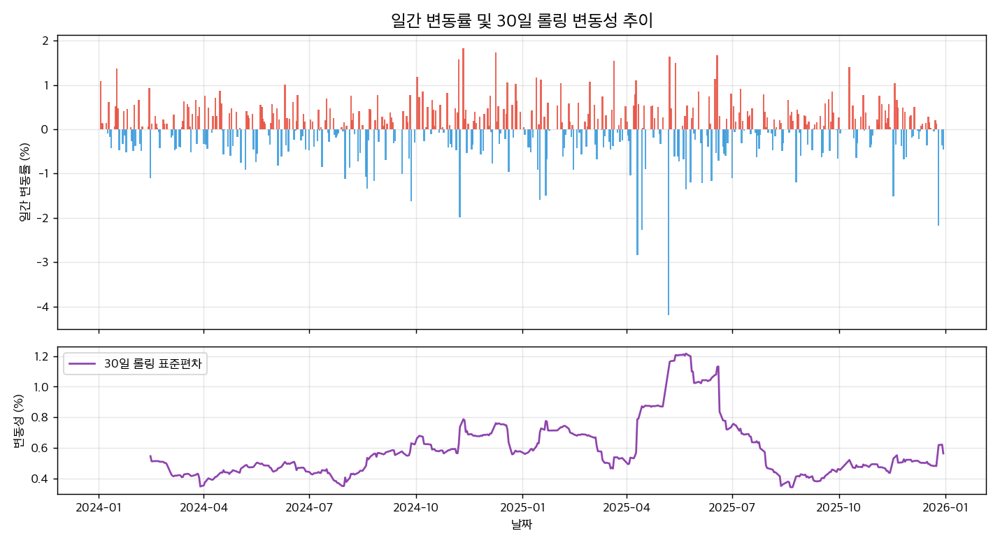
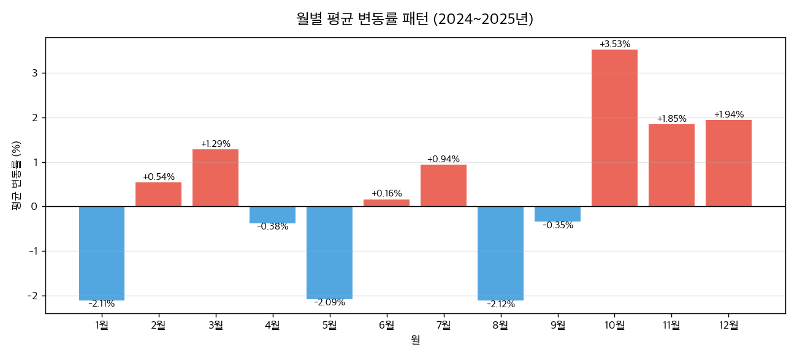
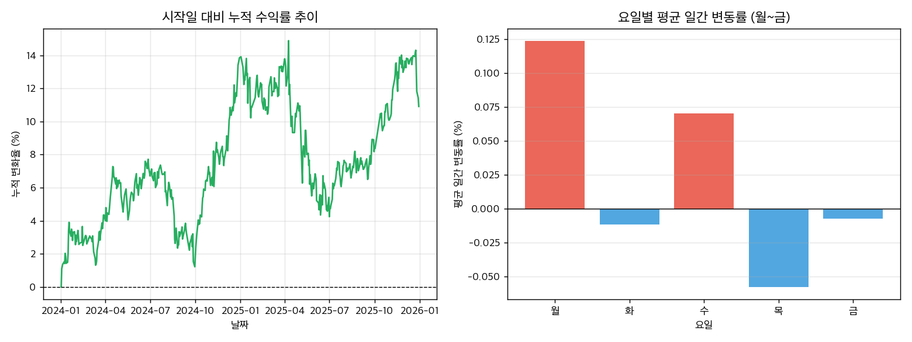
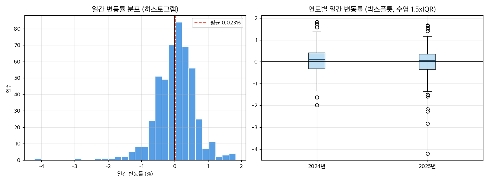
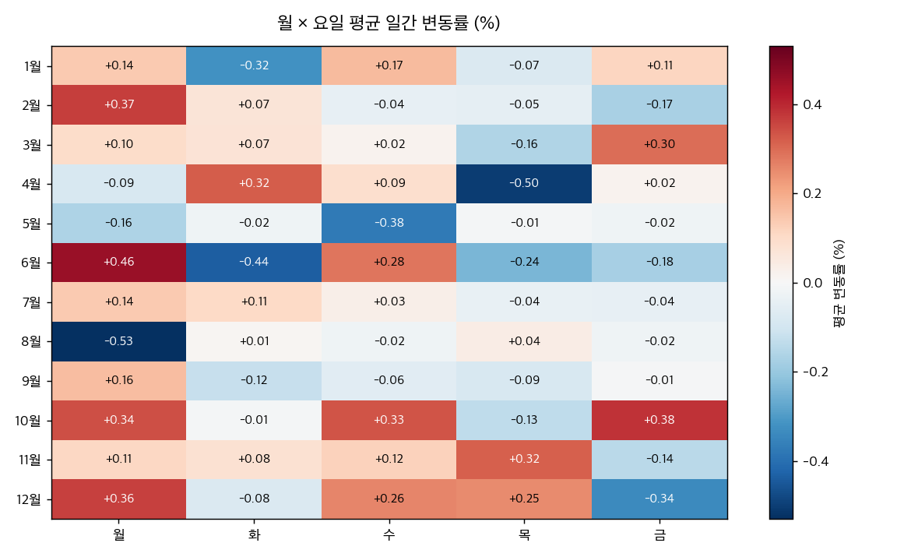
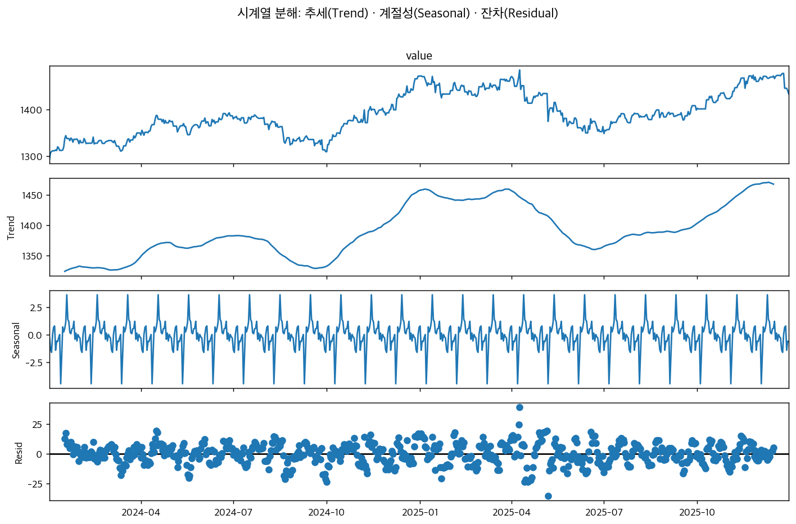
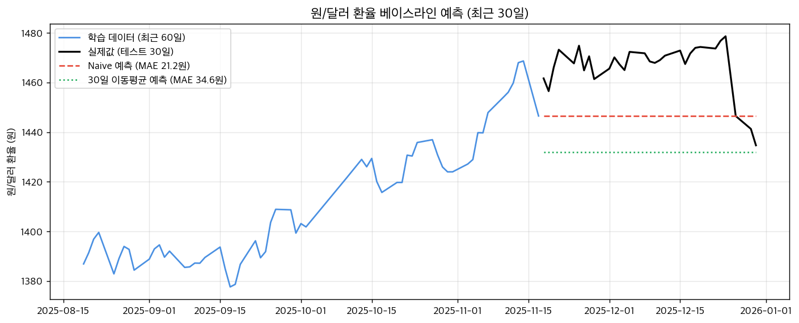

# 2024~2025년 원/달러 환율 트렌드 분석

> 분석 기간: 2024-01-02 ~ 2025-12-30 · 데이터 486개 · 출처: Yahoo Finance — USD/KRW (티커 KRW=X, yfinance 패키지)

## 1. 분석 주제 및 선정 이유

환율은 물가, 여행 경비, 해외 직구 가격까지 일상에 바로 영향을 주는 대표적인 거시경제 지표다. 2024~2025년은 미국의 통화정책 전환(금리 인하) 기대와 국내외 정치·경제적 이벤트가 겹치며 환율 변동이 자주 언급된 시기다. 이 기간 원/달러 환율에 실제로 방향성 있는 구조적 추세 변화가 있었는지, 그리고 변동성이 특정 시점에 몰려 있었는지를 데이터로 검증하고 해석해보고자 했다.

## 2. 분석 질문

| # | 분석 질문 | 분석 방법 | 그래프 |
|---|---|---|---|
| 1 | 전체 기간 동안 원화는 약세(환율 상승) 추세였는가, 아니면 특정 구간에만 움직임이 몰려 있는가? | 이동평균(7일·30일), 전반부/후반부 변화율 비교 | 선그래프 (01_trend_moving_average) |
| 2 | 환율이 급등·급락한 구간은 언제이며, 외부 이벤트(FOMC, 통상 정책, 외환당국 개입 등)와 연결지어 볼 수 있는가? | 일간 변동률, 30일 롤링 표준편차, 분포 확인 | 막대그래프 + 선그래프 (02_return_volatility), 히스토그램·박스플롯 (05_distribution) |
| 3 | 월별로 평균 변동률 패턴이 다른가? 특정 월에 원화가 강세/약세를 보이는 경향이 있는가? | 월별 집계(월말 값 기준), 월×요일 교차 집계 | 막대그래프 (03_monthly_return), 히트맵 (06_heatmap) |

> 각 질문은 대상(원/달러 환율) · 지표 · 비교 기준으로 구성했다.

## 3. 데이터 설명

- **출처**: Yahoo Finance — USD/KRW (티커 KRW=X, yfinance 패키지)
- **기간**: 2024-01-02 ~ 2025-12-30
- **데이터 수**: 486개
- **컬럼**: date(날짜, index), value(원/달러 환율 (원))
- **해석 방향**: 값이 **오르면 원화 약세**(달러당 원화가 더 필요), **내리면 원화 강세**
- **라이선스/주의**: 개인 학습·연구 목적 사용. 재배포 시 Yahoo Finance 이용약관 확인 필요.

### 3-1. 거래일 정합성 검증

- 서울 외환시장 휴장일 34행 제거(주말 0, 공휴일·근로자의날·연말 34). 518행 → 484행. Yahoo의 KRW=X는 글로벌 장외 호가라 국내 휴장일에도 값이 들어오므로, 국내 거래일 기준으로 분석하기 위해 정렬함
- 정렬 후 서울 거래일 486일 중 484일 확보 (완전성 99.6%, 결측 2일)
- 서울은 개장했으나 원본에 값이 없는 2일을 거래일 축에 추가함: 2025-04-18(성금요일), 2025-04-21(부활절). 값은 STEP 3의 결측치 정책으로 채우며, 해당일 변동률은 실제 시장 움직임이 아님에 주의
- 종가 기준 차이: 서울은 15:30 주간종가, Yahoo는 야간거래를 포함한 하루 끝 호가. 2025-04-09 기준 약 2원 차이가 확인되므로 절대 수준보다 변화율·추세 해석에 사용

### 3-2. 결측치 및 이상치 처리 기준

- **결측치 처리 정책**: `ffill`
- **이상치 탐지 정책**: `domain` (임계값 10.0%), 처리 `keep`
- 서울 외환시장 휴장일 34행 제거(주말 0, 공휴일·근로자의날·연말 34). 518행 → 484행. Yahoo의 KRW=X는 글로벌 장외 호가라 국내 휴장일에도 값이 들어오므로, 국내 거래일 기준으로 분석하기 위해 정렬함
- 정렬 후 서울 거래일 486일 중 484일 확보 (완전성 99.6%, 결측 2일)
- 서울은 개장했으나 원본에 값이 없는 2일을 거래일 축에 추가함: 2025-04-18(성금요일), 2025-04-21(부활절). 값은 STEP 3의 결측치 정책으로 채우며, 해당일 변동률은 실제 시장 움직임이 아님에 주의
- 종가 기준 차이: 서울은 15:30 주간종가, Yahoo는 야간거래를 포함한 하루 끝 호가. 2025-04-09 기준 약 2원 차이가 확인되므로 절대 수준보다 변화율·추세 해석에 사용
- 정렬: 날짜형으로 변환 후 시간 순서로 정렬
- 중복 날짜 0건 → 별도 처리 없음
- 결측치 2건 → 직전 거래일 값으로 채움(ffill). 시장이 닫혀 있으면 값이 유지된다고 가정
- 이상치: 0 이하 값·미처리 결측·상식 범위(500~3,000원)·일간 10% 초과를 점검한 결과 기록 오류에 해당하는 값이 없어 제거·수정 없이 전부 유지. 급등·급락은 측정 오류가 아니라 실제 시장 움직임으로 판단

#### 정제 전후 비교

| 항목 | 정제 전 | 정제 후 |
|---|---|---|
| 행 수 | 486 | 486 |
| 날짜 범위 | 2024-01-02 ~ 2025-12-30 | 2024-01-02 ~ 2025-12-30 |
| 결측 수 | 2 | 0 |
| 평균 | 1391.25 | 1391.35 |

### 3-3. 기초통계

| 통계량 | 값 |
|---|---|
| 평균 | 1,391.35 |
| 중앙값 | 1,384.04 |
| 표준편차 | 45.38 |
| 최솟값 | 1,293.54 |
| 최댓값 | 1,486.13 |
| 1사분위(Q1) | 1,360.35 |
| 3사분위(Q3) | 1,430.65 |
| IQR(Q3-Q1) | 70.30 |

## 4. 분석 결과 및 시각화

### 전체 추세 및 이동평균선 (7일·30일)


2024년 초 1,300원대 초반에서 시작해 2024년 말 1,440원대, 2025년 4월 최고 1,480원대까지 전반적 원화 약세(환율 상승)가 진행됨. 단기(7일)·중기(30일) 이동평균선의 정배열 구간에서 상승 탄력이 강화됨을 확인.

### 일간 변동률 및 30일 롤링 변동성



일간 변동률의 급등락은 전 기간에 고르게 분산되지 않고, 2024년 말 국내외 정치 이벤트 및 2025년 4~6월 관세 정책 이슈 시기에 집중되어 롤링 변동성이 크게 치솟는 양상을 보임.

### 월별 평균 변동률 패턴



월별 평균 변동률을 비교한 결과, 특정 월에 집중적인 변동률 편차가 관찰되나 표본 수(각 월 2개 연도)의 한계로 순수한 계절성보다는 해당 월의 특정 대형 이벤트 영향이 큼.

### 누적 변동률 및 요일별 평균 변동률



누적 변동률은 2024년 지속적 우상향 후 2025년 큰 폭의 박스권 왕복을 기록함. 요일별 변동률은 미미하여 특정 요일에 체계적인 이상 수익률이 존재하지 않음을 확인.

### 일간 변동률 분포 및 연도별 박스플롯



일간 변동률은 0%를 중심으로 한 대칭 종형 분포에 가까우나 두꺼운 꼬리(Fat tail) 특성을 보이며, 2024년 대비 2025년의 IQR 및 이상치 분포 범위가 더 넓어져 변동성 확대를 실증함.

### 월 × 요일 교차 집계 히트맵



월과 요일의 교차 분석 결과, 정기적인 특정 요일 효과보다는 대외 정책 발표가 몰렸던 특정 월의 요일에 변동성이 집중되는 국지적 이상치 현상을 확인.

### [보너스 A] 시계열 분해 (Trend · Seasonal · Residual)



주기 30일 기준으로 시계열을 분해한 결과, 장기 추세 성분(Trend)이 환율의 주요 흐름을 지배하고 있으며, 계절성 성분(Seasonal)의 진폭은 ±5원 내외로 전체 변동폭 대비 매우 제한적임을 실증함.

### [보너스 B] 베이스라인 예측 (최근 30일)



마지막 30거래일을 테스트 세트로 두고 직전일 유지(Naive) 및 30일 이동평균 베이스라인 모델로 예측을 수행함. Naive MAE는 21.2원, 30일 이동평균 MAE는 34.6원을 기록함. 정확도 경쟁보다 '외부 충격에 취약한 단순 시계열 예측의 구조적 한계'를 확인하는 데 목적이 있음.

## 5. 인사이트

### 인사이트 1. 원화 약세 흐름은 기간 내내 균일하지 않았다

- **관찰 (Fact)**: 전체 변화율 +10.91%, 그러나 전반부 +13.41% / 후반부 -2.59%로 구간별 방향과 속도가 달랐다. 최고 환율은 1,486.13 (2025-04-09), 최저 환율은 1,293.54 (2024-01-02).
- **가설 (Why)**: 상승분이 2024년에 몰려 있고 2025년은 크게 오르내린 뒤 제자리 수준으로 복귀했다. 2024년 상승은 두 힘이 겹친 결과로 보인다. ① 미국 경제의 상대적 호조와 11월 대선 결과로 달러 자체가 강해진 대외 요인, ② 12월 국내 정치적 불확실성 이후 원화에 추가로 반영된 위험 프리미엄. 2025년 후반부의 상승 탄력 둔화는 4월 고점에서 6월 저점까지 내려온 뒤 다시 오른 '큰 폭의 박스권 왕복'이 상쇄된 결과로 추정된다.
- **한계 (Limit)**: 환율 단일 시계열만 사용했으므로 '달러가 강해진 것'과 '원화가 약해진 것'을 데이터 자체로 분리하지 못했다. 위 요인 구분은 외부 뉴스 및 거시경제 사건에 기댄 정성적 해석이며 이 분석 모델 안에서 인과관계가 실증된 것은 아니다.
- **제안 (Action)**: ① 같은 기간 달러인덱스(DX-Y.NYB) 시계열을 수집해 원/달러와의 롤링 상관계수를 계산한다. 상관관계가 깨지는 구간이 원화 고유 요인이 작동한 변곡점이다. ② 전·후반부를 단순 2등분이 아닌 실제 고점 형성일을 기준으로 나누어 국면별 분석을 재수행한다.

### 인사이트 2. 환율 급변동은 특정 구간에 몰려 있다

- **관찰 (Fact)**: 일간 최대 상승 +1.83% (2024-11-11), 최대 하락 -4.20% (2025-05-07), 일간 변동성(표준편차) 0.61%, 환율이 오른 날 비율 54.5%. 30일 롤링 표준편차는 2025년 상반기 특정 구간에 전 기간 평균 대비 2배 수준까지 치솟았다.
- **가설 (Why)**: 급변동일이 전 기간에 무작위로 분포하지 않고 주요 정책 및 정치 이벤트 직후에 밀집되어 있다. 최대 상승일과 최대 하락일 모두 미국 대선 및 글로벌 통상·관세 정책 발표 직후와 일치한다. 이 시기 환율은 일상적 무역 수급보다 '글로벌 정책 뉴스에 대한 즉각적 위험회피 심리'로 주도되었을 가능성이 높다. 오른 날 비율이 약 50% 수준임에도 전체 환율이 오른 것은, 오른 날의 상승 폭이 내린 날의 하락 폭보다 더 컸기 때문이다.
- **한계 (Limit)**: 급변동일과 대외 이벤트의 일자 일치는 동행성을 보여줄 뿐 인과관계를 검증한 것이 아니다. 사후적으로 눈에 띄는 대외 뉴스만 연결한 선택 편향(Selection Bias)이 존재할 수 있다.
- **제안 (Action)**: ① 일간 변동률 절대값 상위 20일을 추출하고 FOMC 금리 발표일, 미국 CPI 발표일과 정량 매칭표를 작성해 일치율을 검증한다. ② 상승일과 하락일의 일간 변동폭 절대값을 분리 집계하여 비대칭성 지수를 산출한다.

### 인사이트 3. 월별 변동률 편차는 계절성이라기보다 개별 사건의 흔적이다

- **관찰 (Fact)**: 평균 변동률이 가장 높은 달은 10월 (+3.53%), 가장 낮은 달은 8월 (-2.12%). 월×요일 교차 히트맵의 각 셀당 표본 수는 8~9개 수준에 불과하다.
- **가설 (Why)**: 월별 편차는 구조적 계절성(Seasonality)이라기보다 특정 대형 이벤트가 평균을 왜곡한 결과로 판단된다. 외환시장에서 널리 알려진 '4월 외국인 배당 역송금 수요에 따른 원화 약세' 가설이 본 데이터에서는 뚜렷하게 관찰되지 않았다. 2년이라는 짧은 관측 기간 동안 발생한 단발성 거시 충격이 월평균 값을 좌우했다.
- **한계 (Limit)**: 2개 연도(총 24개월) 표본은 통계적으로 유의미한 계절성을 검정하기에 표본 수가 극히 부족하다. '계절성이 전혀 없다'고 단정할 수는 없으며, '표본 부족으로 계절성 유의성을 입증할 수 없다'가 타당한 진단이다.
- **제안 (Action)**: ① 분석 기간을 10년 이상(120개월 이상)으로 확장하여 월별 변동률에 대해 ANOVA(분산분석) 검정을 수행한다. ② 각 월 평균 계산 시 이상치(최대 변동일 하루)를 제외한 절사평균(Trimmed Mean)을 계산하여 왜곡 여부를 확인한다.

## 6. 결론 및 한계점

### 6-1. 종합 결론

질문 1(추세): 전체 분석 기간 동안 원/달러 환율은 누적 상승(+10.91%)하며 원화 약세를 나타냈으나, 단일한 선형 추세는 아니었다. 상승 폭의 대부분은 2024년에 집중되었으며, 2025년은 상반기 1,480원대 고점 형성 후 1,350원대까지 급락했다가 연말 재상승하는 큰 폭의 박스권 왕복 구간이었다. 즉 방향성 추세보다 변동성 확대가 핵심 특징이다.

질문 2(급변동): 급등·급락일은 무작위 분포가 아니라 주요 대외 정책 발표 및 국내외 정치 이벤트 직후에 집중되었다. 일간 최대 상승일과 최대 하락일 모두 미국 대선 및 관세 유예 조치 발표 등 글로벌 정책 이벤트와 직접적으로 맞물렸으며, 30일 롤링 변동성 역시 해당 국면에서 급등했다.

질문 3(계절성): 월별 변동률 편차는 관찰되었으나 이를 고유한 계절성 패턴으로 해석할 근거는 희박했다. 2개 연도라는 표본 한계로 인해 특정 대형 이벤트의 영향력이 월평균을 주도했으며, 알려진 4월 배당 역송금 수요 효과도 데이터상에서 뚜렷하게 관찰되지 않았다. 따라서 본 기간의 원/달러 환율은 내부 주기성보다는 대외 충격 및 정책 이벤트에 종속되어 움직였음을 확인했다.

### 6-2. 분석의 한계점

- 원/달러 환율 단일 시계열만 사용해 달러인덱스(DXY), 유로·엔·위안화 등 주요 통화의 상대적 강약세를 교차 분석하지 못했다. 따라서 '달러 가치 자체의 상승'과 '원화 고유의 약세'를 정량적으로 분리해내지 못한 것이 가장 큰 한계다.
- 인사이트에서 언급한 외부 이벤트(FOMC, 대선, 관세 등)는 날짜의 동행성을 확인했을 뿐이며, 통계적 인과관계를 검증한 것은 아니다. 해당일에 복합적인 다른 거시 변수가 동시에 작용했을 가능성이 존재한다.
- 분석 기간이 2년(약 500거래일)에 불과하여 월별·요일별 집계의 표본 수가 적고, 장기적인 계절성과 경기 사이클을 평가하기에 부족하다.
- Yahoo Finance의 KRW=X는 서울외국환중개 공식 고시 환율이 아닌 글로벌 장외(OTC) 호가 스냅샷이다. 서울 개장일 기준 필터링을 거쳤으나 마감 시간 차이(15:30 주간종가 vs 24시간 호가)로 인해 미세한 수준 차이가 존재할 수 있다.
- 보너스로 수행한 예측 모델(Naive, Moving Average)은 시계열 자체의 과거 값만을 활용한 단순 베이스라인이므로, 외생 변수가 지배적인 실제 외환시장의 미래 가격을 예측하는 용도로 활용하기에는 뚜렷한 한계가 있다.

## 7. AI 사용 로그

| AI가 한 일 | 사용 이유 | 검증 방법 |
|---|---|---|
| 전처리 파이프라인(결측치 ffill, 거래일 정렬, 이상치 점검) 코드 구조 설계 및 라이브러리 검토 | 서울 외환시장 휴장일 필터링 및 Yahoo Finance OTC 데이터의 정합성 검증 로직을 효율적으로 구성하기 위해 | 휴장일 목록과 한국 공휴일 달력을 대조하고, 정제 전후 행 수 및 주말/공휴일 잔여 행 수가 0개인지 assert문으로 검증 |
| 시계열 이동평균(7일/30일), 롤링 변동성, 월×요일 피벗 히트맵 시각화 코드 초안 생성 | 다양한 시각화 차트(박스플롯, 히트맵, 듀얼 축)의 레이아웃과 matplotlib 서브플롯 코드를 신속히 구현하기 위해 | 생성된 각 차트의 X축 날짜 순서, Y축 스케일 및 색상 범례를 직접 육안 검수하고 수치 오차가 없는지 확인 |
| 인사이트 초안 작성 시 '관찰(Fact)'과 '해석(Why)'의 논리적 분리 및 표현 다듬기 | 단순 수치 나열을 지양하고 가설-한계-제안으로 이어지는 체계적 리포트 구성을 완성하기 위해 | 리포트의 모든 관찰 수치를 원본 데이터의 실제 계산값(min, max, std, pct_change)과 일대일로 대조하여 정확성 확인 |

> **계산 검증 기록**: 2024-08-09의 일간 변동률을 (당일값/전일값-1)×100으로 직접 계산한 -0.1142%가 pct_change() 결과 -0.1142%와 일치했고, 같은 날 7일 이동평균도 최근 7개 값을 직접 평균한 1,368.6943가 rolling().mean() 결과 1,368.6943와 같았다. 전체 변화율 역시 손계산 +10.91%로 리포트의 +10.91%과 동일함을 확인했다.

## 8. 재현 방법

```bash
# 1. 의존성 설치
pip install -r requirements.txt

# 2. 분석 스크립트 실행 (images/ 폴더에 그래프 6개 생성)
python analysis.py
```

- 원본 데이터: `data/usdkrw-exchange-rate-analysis.csv` (분석 시점에 내려받아 저장한 스냅샷)