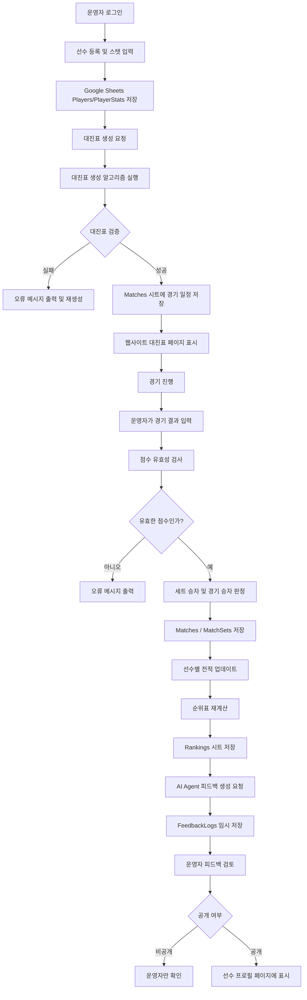
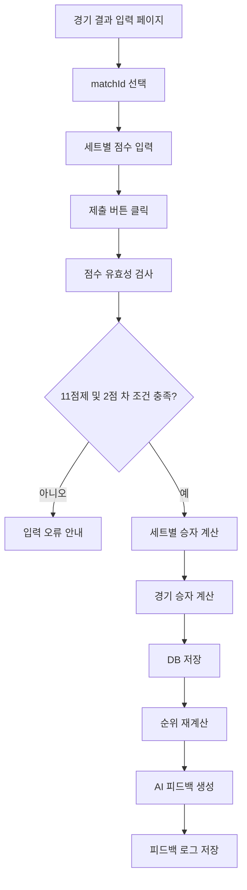
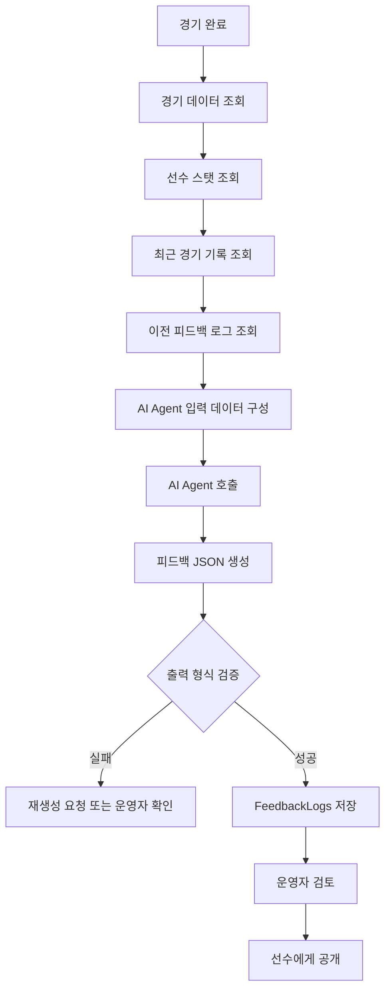

# 스쿼시 ESL 리그 운영 웹사이트 및 AI Agent 구축 계획서

## 0. 프로젝트 개요

본 프로젝트는 스쿼시 ESL 리그 운영 과정에서 반복적으로 발생하는 업무를 웹사이트와 AI Agent를 활용해 자동화하는 것을 목표로 한다.

리그 운영에는 크게 두 종류의 업무가 있다.

1. **정답이 명확한 업무**
   - 대진표 생성
   - 경기 결과 기록
   - 승패 및 순위 계산
   - 선수별 스탯 집계

2. **정답이 하나로 정해지지 않는 업무**
   - 선수 프로필 문장화
   - 경기 후 피드백 작성
   - 성장 방향 제안
   - 누적 경기 기록을 바탕으로 한 코멘트 생성

이번 시스템에서는 이 두 영역을 구분해서 설계했다.

- 대진표, 순위, 점수 계산처럼 오류가 있으면 안 되는 부분은 **알고리즘으로 구현**
- 선수 피드백, 프로필 요약처럼 해석과 문장 생성이 필요한 부분은 **AI Agent로 구현**

즉, AI를 모든 영역에 무리하게 적용하기보다는,  
**AI가 잘할 수 있는 영역과 알고리즘이 더 안전한 영역을 분리하는 것**을 핵심 방향으로 삼았다.

---

# 1. 문제 및 배경상황 설명

## 1-1. 리그 운영 배경

스쿼시 ESL 리그는 여러 명의 참가자가 정해진 규칙에 따라 경기를 진행하고, 경기 결과에 따라 순위와 선수 기록이 누적되는 방식으로 운영된다.

운영 과정에서 필요한 주요 업무는 다음과 같다.

- 참가 선수 등록
- 선수별 기본 정보 및 실력 정보 관리
- 경기 대진표 생성
- 경기 결과 입력
- 승패, 세트 스코어, 득실 계산
- 순위표 업데이트
- 선수별 경기 기록 저장
- 선수별 스탯 업데이트
- 경기 후 피드백 작성
- 다음 경기 또는 시즌을 위한 참고 자료 정리

기존 방식에서는 이 과정 대부분을 수작업으로 처리해야 했다.

예를 들어, 대진표를 만들 때는 참가 인원 수, 시드, 실력 차이, 동일 선수 중복 여부 등을 직접 확인해야 했다. 경기 결과가 나온 뒤에도 운영자가 기록을 입력하고, 순위를 다시 계산하고, 선수별 기록을 따로 정리해야 했다.

특히 경기 후 피드백은 매번 사람이 작성하기 어렵기 때문에 생략되는 경우가 많았다. 하지만 참가자 입장에서는 단순히 승패만 아는 것보다, 본인이 어떤 부분이 좋았고 어떤 점을 보완해야 하는지 확인하는 것이 훨씬 유용하다.

---

## 1-2. 기존 운영 방식의 문제점

### 1) 대진표 작성의 번거로움

대진표는 단순히 랜덤으로 섞는 방식으로 만들기 어렵다.

고려해야 할 조건이 많다.

- 참가 인원이 홀수인지 짝수인지
- 부전승이 필요한지
- 시드 선수를 어디에 배치할지
- 같은 선수가 중복 배정되지 않았는지
- 특정 선수가 같은 라운드에 두 번 들어가지 않았는지
- 실력 차이가 너무 큰 매칭이 초반부터 발생하지 않는지
- 이전에 만난 상대와 너무 자주 다시 만나지 않는지

이런 조건을 사람이 직접 확인하면 시간이 오래 걸리고 실수 가능성이 높다.

---

### 2) 경기 결과와 순위 반영의 반복 작업

경기가 끝나면 다음과 같은 기록이 필요하다.

- 경기 날짜
- 선수 A
- 선수 B
- 세트별 점수
- 최종 승자
- 최종 패자
- 승점
- 득실
- 누적 전적
- 순위 변동

이 정보가 선수 프로필, 경기 기록, 순위표, 피드백 로그에 모두 연결되어야 한다.

하지만 수작업으로 관리하면 하나의 결과를 여러 곳에 중복 입력해야 하고, 일부 기록이 누락될 가능성이 있다.

---

### 3) 선수별 성장 기록 관리의 어려움

리그를 단순 경기 운영이 아니라 성장형 프로그램으로 만들기 위해서는 선수별 기록 관리가 중요하다.

필요한 정보는 다음과 같다.

- 선수의 기본 실력
- 포핸드/백핸드/파워 등 세부 능력치
- 최근 경기 흐름
- 자주 지는 유형
- 강점과 약점
- 경기 후 피드백
- 이전 피드백 대비 개선 여부

하지만 이런 내용은 숫자만으로 표현하기 어렵다.  
사람이 매번 직접 작성하려면 시간이 많이 들고, 운영자의 주관이 많이 개입될 수 있다.

---

# 2. AI를 활용하여 해결하게 된 이유

## 2-1. 모든 문제를 AI로 해결하지 않은 이유

처음에는 AI Agent를 활용해 리그 운영 전체를 자동화하는 방안도 생각했다.  
하지만 설계하면서 다음과 같은 결론을 내렸다.

> 정답이 있는 영역은 AI보다 알고리즘이 더 적합하다.

예를 들어 대진표 생성이나 승점 계산은 명확한 규칙이 있다.  
이런 작업은 같은 입력에 대해 항상 같은 결과가 나와야 한다.

만약 AI에게 대진표 생성을 맡겼을 때 다음과 같은 문제가 발생할 수 있다.

- 선수가 누락될 수 있음
- 같은 선수가 중복 배치될 수 있음
- 부전승 계산이 틀릴 수 있음
- 시드 배치가 일관되지 않을 수 있음
- 결과 검증을 다시 사람이 해야 함

따라서 대진표와 점수 계산은 AI가 아니라 코드 기반 알고리즘으로 처리하는 것이 맞다고 판단했다.

---

## 2-2. AI Agent가 필요한 영역

반대로, 선수 프로필과 경기 피드백은 정답이 하나로 정해져 있지 않다.

예를 들어 같은 경기 결과라도 다음과 같이 다양한 해석이 가능하다.

- 초반에는 밀렸지만 후반에 적응력이 좋았다.
- 백핸드 쪽 수비에서 실점이 많았다.
- 랠리가 길어질수록 집중력이 떨어졌다.
- 공격력은 좋지만 실수가 많았다.
- 상대보다 파워는 좋지만 경기 운영이 단조로웠다.

이런 내용은 단순한 if문으로 작성하면 너무 기계적인 문장이 된다.

따라서 AI Agent는 다음 역할을 맡도록 설계했다.

- 선수별 누적 경기 기록 분석
- 선수 스탯 기반 프로필 문장 생성
- 경기 결과 기반 피드백 작성
- 이전 피드백과 비교한 개선점 정리
- 다음 경기에서 집중할 포인트 추천

즉, AI Agent는 **운영자의 보조 코치 역할**을 하도록 설계했다.

---

# 3. 해결 과정 및 구현 계획

## 3-1. 전체 시스템 구조

전체 시스템은 웹사이트를 중심으로 구성된다.

사용자는 웹사이트에서 선수 등록, 대진 확인, 경기 결과 입력, 순위 확인, 선수 프로필 및 피드백 조회를 할 수 있다.

```text
[사용자]
  ├─ 운영자
  │   ├─ 선수 등록
  │   ├─ 대진표 생성
  │   ├─ 경기 결과 입력
  │   └─ 피드백 생성 요청
  │
  └─ 선수
      ├─ 본인 프로필 확인
      ├─ 경기 일정 확인
      ├─ 경기 결과 확인
      ├─ 순위 확인
      └─ AI 피드백 확인

        ↓

[웹사이트 Frontend]
  ├─ 선수 목록 페이지
  ├─ 선수 상세 프로필 페이지
  ├─ 대진표 페이지
  ├─ 경기 결과 입력 페이지
  ├─ 순위표 페이지
  └─ 피드백 로그 페이지

        ↓

[Backend API]
  ├─ 선수 데이터 관리
  ├─ 대진표 생성 알고리즘 실행
  ├─ 경기 결과 저장
  ├─ 순위 및 스탯 계산
  ├─ DB 읽기/쓰기
  └─ AI Agent 호출

        ↓

[Database]
  ├─ Players
  ├─ PlayerStats
  ├─ Matches
  ├─ MatchSets
  ├─ Rankings
  └─ FeedbackLogs

        ↓

[AI Agent]
  ├─ 선수 프로필 요약 생성
  ├─ 경기별 피드백 생성
  ├─ 누적 피드백 요약
  └─ 다음 경기 개선 포인트 생성
```

---

# 4. 경기 규칙 및 알고리즘 처리 계획

## 4-1. 경기 기본 규칙

경기 규칙은 데이터베이스와 알고리즘에서 동일하게 관리한다.  
규칙이 바뀌더라도 코드 전체를 수정하지 않고 설정값만 수정할 수 있도록 설계한다.

| 항목 | 내용 |
|---|---|
| 경기 방식 | 1:1 개인전 |
| 세트 방식 | 3판 2선승 또는 설정값 기반 |
| 점수 방식 | 11점제 기준 |
| 듀스 규칙 | 10:10 이후 2점 차 승리 |
| 승자 결정 | 세트를 더 많이 획득한 선수 |
| 경기 기록 단위 | 경기 단위 + 세트 단위 |
| 순위 기준 | 승수, 승률, 세트 득실, 점수 득실 등 |
| 부전승 | 참가자 수가 맞지 않을 경우 자동 배정 |
| 대진 중복 방지 | 같은 라운드 내 중복 선수 배정 금지 |

실제 운영 규칙이 달라질 수 있으므로, 다음 값들은 설정값으로 관리한다.

```json
{
  "pointsToWin": 11,
  "winBy": 2,
  "bestOf": 3,
  "rankingPriority": [
    "wins",
    "winRate",
    "setDiff",
    "pointDiff"
  ]
}
```

---

## 4-2. 대진표 생성 알고리즘

대진표는 AI가 아니라 알고리즘으로 생성한다.

이유는 다음과 같다.

- 대진표에는 명확한 정답 조건이 있음
- 선수 누락이나 중복이 발생하면 안 됨
- 같은 입력에 대해 같은 결과가 나와야 함
- 결과를 사람이 다시 검증하지 않아도 되어야 함

---

## 4-3. 대진표 생성 시 고려 조건

대진표 생성 알고리즘은 다음 조건을 반영한다.

### 필수 조건

| 조건 | 설명 | 해결 방식 |
|---|---|---|
| 선수 중복 방지 | 한 선수가 같은 라운드에 두 번 배정되면 안 됨 | 선수 ID 기준 Set으로 검증 |
| 선수 누락 방지 | 참가 신청한 모든 선수가 포함되어야 함 | 참가자 목록과 대진표 배정 목록 비교 |
| 부전승 처리 | 참가자 수가 2의 거듭제곱이 아닐 경우 필요 | 다음 2의 거듭제곱까지 BYE 자동 추가 |
| 승자 진출 구조 | 토너먼트 진행 시 승자가 다음 라운드로 이동 | Match의 nextMatchId로 연결 |
| 결과 확정 전 다음 라운드 대진 보류 | 승자가 결정되어야 다음 라운드 확정 | winnerId가 생기면 다음 매치 슬롯 업데이트 |

---

### 선택 조건

| 조건 | 설명 | 해결 방식 |
|---|---|---|
| 시드 배정 | 상위 실력자들이 초반에 바로 만나지 않도록 배치 | 랭킹/스탯 기준 상위 선수 분산 배치 |
| 실력 균형 | 너무 큰 실력 차이를 줄임 | 선수 rating 기준으로 그룹화 |
| 재대결 최소화 | 최근에 만난 상대와 다시 만나는 횟수 줄임 | match history 기반 페널티 적용 |
| 같은 팀/소속 회피 | 같은 그룹 선수 초반 대진 방지 | club/team 필드 기준 제약 조건 적용 |

---

## 4-4. 부전승 계산 방식

참가자 수가 2의 거듭제곱이 아닐 경우 부전승이 필요하다.

예시:

| 참가자 수 | 필요한 슬롯 수 | 부전승 수 |
|---:|---:|---:|
| 5명 | 8슬롯 | 3명 |
| 6명 | 8슬롯 | 2명 |
| 7명 | 8슬롯 | 1명 |
| 9명 | 16슬롯 | 7명 |
| 13명 | 16슬롯 | 3명 |

계산 방식:

```text
slotSize = 참가자 수보다 크거나 같은 가장 작은 2의 거듭제곱
byeCount = slotSize - 참가자 수
```

예시:

```text
참가자 수 = 13
slotSize = 16
byeCount = 3

따라서 3명의 선수는 1라운드 부전승 처리
```

---

## 4-5. 대진표 생성 의사코드

```pseudo
function generateBracket(players):
    playerCount = players.length
    slotSize = nextPowerOfTwo(playerCount)
    byeCount = slotSize - playerCount

    seededPlayers = sortBySeedOrRating(players)

    byePlayers = selectByePlayers(seededPlayers, byeCount)
    normalPlayers = players - byePlayers

    bracketSlots = createEmptySlots(slotSize)

    placeSeededPlayers(bracketSlots, seededPlayers)
    placeByePlayers(bracketSlots, byePlayers)
    fillRemainingSlots(bracketSlots, normalPlayers)

    matches = createRoundOneMatches(bracketSlots)

    validateNoDuplicatePlayers(matches)
    validateAllPlayersIncluded(matches, players)

    return matches
```

---

## 4-6. 대진표 검증 로직

대진표 생성 후에는 반드시 검증 과정을 거친다.

```pseudo
function validateBracket(matches, players):
    assignedPlayerIds = []

    for match in matches:
        if match.playerAId != null:
            assignedPlayerIds.push(match.playerAId)

        if match.playerBId != null:
            assignedPlayerIds.push(match.playerBId)

    if hasDuplicate(assignedPlayerIds):
        throw Error("중복 배정된 선수가 있습니다.")

    if assignedPlayerIds.length != players.length:
        throw Error("누락된 선수가 있습니다.")

    for player in players:
        if player.id not in assignedPlayerIds:
            throw Error(player.name + " 선수가 대진표에서 누락되었습니다.")

    return true
```

---

# 5. 선수 프로필 및 스탯 설계

## 5-1. 선수 프로필 구성

선수 프로필은 단순 이름표가 아니라, 리그에서 선수의 현재 상태를 보여주는 페이지로 설계한다.

### 기본 정보

| 필드 | 설명 |
|---|---|
| playerId | 선수 고유 ID |
| name | 선수 이름 |
| nickname | 닉네임 |
| level | 실력 레벨 |
| dominantHand | 주 사용 손 |
| playStyle | 플레이 스타일 |
| joinedAt | 등록일 |
| status | 활동 상태 |

---

## 5-2. 선수 능력치 스탯

선수 스탯은 경기 기록과 운영자 평가를 바탕으로 관리한다.

| 스탯 | 설명 |
|---|---|
| power | 파워, 샷의 강도 |
| forehand | 포핸드 안정성 및 공격력 |
| backhand | 백핸드 안정성 및 공격력 |
| serve | 서브 정확도와 위력 |
| returnSkill | 리턴 대응 능력 |
| volley | 발리 대응 능력 |
| dropShot | 드롭샷 활용 능력 |
| boast | 보스트샷 활용 능력 |
| drive | 드라이브샷 정확도와 깊이 |
| courtCoverage | 코트 커버 범위와 발 움직임 |
| stamina | 체력 및 후반 집중력 |
| consistency | 실수 관리 능력, 안정성 |
| gameSense | 경기 운영 능력 |
| mental | 멘탈, 위기 상황 대응력 |

각 스탯은 1~10점 또는 1~100점 기준으로 관리할 수 있으며, 초기에는 운영자가 입력하고 이후에는 경기 기록과 피드백 데이터를 바탕으로 일부 자동 보정하는 방식을 고려한다.

예시:

```json
{
  "playerId": "P001",
  "power": 82,
  "forehand": 78,
  "backhand": 64,
  "serve": 70,
  "returnSkill": 73,
  "volley": 68,
  "dropShot": 61,
  "boast": 66,
  "drive": 80,
  "courtCoverage": 75,
  "stamina": 72,
  "consistency": 69,
  "gameSense": 71,
  "mental": 74
}
```

---

## 5-3. 선수 프로필 페이지 구성

웹사이트의 선수 프로필 페이지에는 다음 정보를 표시한다.

### 선수 프로필 화면 구성

| 영역 | 표시 내용 |
|---|---|
| 기본 정보 | 이름, 닉네임, 레벨, 주 사용 손, 참가 시즌 |
| 종합 스탯 | 파워, 포핸드, 백핸드, 서브, 리턴, 체력 등 |
| 경기 전적 | 총 경기 수, 승, 패, 승률 |
| 세트 기록 | 획득 세트, 잃은 세트, 세트 득실 |
| 점수 기록 | 득점, 실점, 점수 득실 |
| 최근 경기 | 최근 3~5경기 결과 |
| AI 요약 프로필 | 선수의 강점, 약점, 플레이 스타일 요약 |
| 피드백 로그 | 경기별 피드백 기록 |
| 개선 포인트 | 다음 경기에서 집중할 부분 |

---

## 5-4. 선수 프로필 AI 생성 방식

선수 프로필 문장은 AI Agent가 생성한다.

다만 AI가 임의로 내용을 만들어내지 않도록, 반드시 DB에 저장된 데이터만 기반으로 작성하도록 제한한다.

### AI Agent 입력 데이터

```json
{
  "player": {
    "name": "선수A",
    "level": "Intermediate",
    "dominantHand": "Right",
    "playStyle": "공격형"
  },
  "stats": {
    "power": 82,
    "forehand": 78,
    "backhand": 64,
    "serve": 70,
    "returnSkill": 73,
    "stamina": 72,
    "consistency": 69
  },
  "recentMatches": [
    {
      "opponent": "선수B",
      "result": "win",
      "setScore": "2-1",
      "pointDiff": 5
    },
    {
      "opponent": "선수C",
      "result": "loss",
      "setScore": "1-2",
      "pointDiff": -3
    }
  ]
}
```

### AI Agent 출력 예시

```json
{
  "summary": "선수A는 파워와 포핸드 공격력이 강점인 공격형 선수이다. 다만 백핸드 안정성과 긴 랠리 상황에서의 실수 관리가 보완 과제로 보인다.",
  "strengths": [
    "강한 파워를 바탕으로 한 공격 전개",
    "포핸드 쪽에서의 득점 능력",
    "초반 주도권을 잡는 능력"
  ],
  "weaknesses": [
    "백핸드 방향으로 몰렸을 때 안정성이 떨어짐",
    "접전 상황에서 실수가 증가하는 경향",
    "긴 랠리 후반 집중력 유지 필요"
  ],
  "recommendedFocus": [
    "백핸드 리턴 안정화",
    "무리한 공격보다 랠리 유지 선택",
    "후반 세트 체력 관리"
  ]
}
```

---

# 6. 경기 기록 데이터베이스 설계

## 6-1. 경기 기록 관리 방향

경기 기록은 단순히 승패만 저장하지 않는다.

한 경기가 끝나면 다음 데이터들이 서로 연결되어야 한다.

```text
경기 결과 입력
  ↓
Matches 테이블 저장
  ↓
MatchSets 테이블에 세트별 점수 저장
  ↓
선수별 누적 전적 업데이트
  ↓
순위표 재계산
  ↓
선수 스탯 일부 업데이트
  ↓
AI Agent 피드백 생성
  ↓
FeedbackLogs 테이블 저장
  ↓
웹사이트 선수 프로필에 반영
```

즉, 경기 기록은 DB와 웹사이트가 계속 주고받는 중심 데이터이다.

---

## 6-2. Database 테이블 구조

### 1) Players 테이블

| 필드명 | 타입 | 설명 |
|---|---|---|
| playerId | string | 선수 고유 ID |
| name | string | 선수 이름 |
| nickname | string | 닉네임 |
| level | string | 실력 레벨 |
| dominantHand | string | 주 사용 손 |
| playStyle | string | 운영자가 입력한 기본 플레이 스타일 |
| team | string | 소속 또는 그룹 |
| joinedAt | date | 등록일 |
| status | string | active / inactive |

---

### 2) PlayerStats 테이블

| 필드명 | 타입 | 설명 |
|---|---|---|
| statId | string | 스탯 ID |
| playerId | string | 선수 ID |
| power | number | 파워 |
| forehand | number | 포핸드 |
| backhand | number | 백핸드 |
| serve | number | 서브 |
| returnSkill | number | 리턴 |
| volley | number | 발리 |
| dropShot | number | 드롭샷 |
| boast | number | 보스트 |
| drive | number | 드라이브 |
| courtCoverage | number | 코트 커버 |
| stamina | number | 체력 |
| consistency | number | 안정성 |
| gameSense | number | 경기 운영 |
| mental | number | 멘탈 |
| updatedAt | datetime | 마지막 수정일 |

---

### 3) Matches 테이블

| 필드명 | 타입 | 설명 |
|---|---|---|
| matchId | string | 경기 ID |
| seasonId | string | 시즌 ID |
| round | number | 라운드 |
| matchNumber | number | 경기 번호 |
| playerAId | string | 선수 A |
| playerBId | string | 선수 B |
| winnerId | string | 승자 |
| loserId | string | 패자 |
| status | string | scheduled / completed / canceled |
| scheduledAt | datetime | 예정 시간 |
| completedAt | datetime | 종료 시간 |
| playerASetWon | number | 선수 A 획득 세트 |
| playerBSetWon | number | 선수 B 획득 세트 |
| playerAPoints | number | 선수 A 총 득점 |
| playerBPoints | number | 선수 B 총 득점 |
| nextMatchId | string | 토너먼트 다음 경기 ID |

---

### 4) MatchSets 테이블

| 필드명 | 타입 | 설명 |
|---|---|---|
| setId | string | 세트 ID |
| matchId | string | 경기 ID |
| setNumber | number | 세트 번호 |
| playerAScore | number | 선수 A 점수 |
| playerBScore | number | 선수 B 점수 |
| setWinnerId | string | 해당 세트 승자 |

---

### 5) Rankings 테이블

| 필드명 | 타입 | 설명 |
|---|---|---|
| rankingId | string | 순위 ID |
| seasonId | string | 시즌 ID |
| playerId | string | 선수 ID |
| matchesPlayed | number | 경기 수 |
| wins | number | 승 |
| losses | number | 패 |
| winRate | number | 승률 |
| setsWon | number | 획득 세트 |
| setsLost | number | 잃은 세트 |
| setDiff | number | 세트 득실 |
| pointsFor | number | 득점 |
| pointsAgainst | number | 실점 |
| pointDiff | number | 점수 득실 |
| rank | number | 현재 순위 |

---

### 6) FeedbackLogs 테이블

| 필드명 | 타입 | 설명 |
|---|---|---|
| feedbackId | string | 피드백 ID |
| matchId | string | 경기 ID |
| playerId | string | 피드백 대상 선수 |
| opponentId | string | 상대 선수 |
| result | string | win / loss |
| summary | text | 경기 요약 |
| strengths | text | 잘한 점 |
| weaknesses | text | 보완할 점 |
| nextFocus | text | 다음 경기 집중 포인트 |
| generatedBy | string | AI / Coach / Admin |
| createdAt | datetime | 생성일 |
| isVisibleToPlayer | boolean | 선수에게 공개 여부 |

---

# 7. 경기 결과 입력 및 순위 계산 알고리즘

## 7-1. 경기 결과 입력 플로우

운영자는 경기 종료 후 웹사이트에서 다음 정보를 입력한다.

- 경기 ID
- 선수 A 세트별 점수
- 선수 B 세트별 점수
- 경기 완료 여부
- 특이사항이 있다면 메모 입력

입력 예시:

```json
{
  "matchId": "M001",
  "sets": [
    {
      "setNumber": 1,
      "playerAScore": 11,
      "playerBScore": 8
    },
    {
      "setNumber": 2,
      "playerAScore": 9,
      "playerBScore": 11
    },
    {
      "setNumber": 3,
      "playerAScore": 11,
      "playerBScore": 6
    }
  ]
}
```

---

## 7-2. 세트 승자 판정 알고리즘

각 세트는 점수 규칙에 따라 승자를 판정한다.

```pseudo
function determineSetWinner(playerAScore, playerBScore):
    if playerAScore >= 11 and playerAScore - playerBScore >= 2:
        return playerA

    if playerBScore >= 11 and playerBScore - playerAScore >= 2:
        return playerB

    throw Error("유효하지 않은 세트 점수입니다.")
```

듀스 규칙도 이 방식으로 처리할 수 있다.

예를 들어 10:10 이후에는 반드시 2점 차가 나야 하므로, 12:10, 14:12는 유효하지만 11:10은 유효하지 않은 점수로 처리한다.

---

## 7-3. 경기 승자 판정 알고리즘

3판 2선승 기준이라면 먼저 2세트를 가져간 선수가 승리한다.

```pseudo
function determineMatchWinner(sets):
    playerASetWon = 0
    playerBSetWon = 0

    for set in sets:
        setWinner = determineSetWinner(set.playerAScore, set.playerBScore)

        if setWinner == playerA:
            playerASetWon += 1
        else:
            playerBSetWon += 1

    if playerASetWon == 2:
        return playerA

    if playerBSetWon == 2:
        return playerB

    throw Error("경기 승자가 결정되지 않았습니다.")
```

---

## 7-4. 순위 계산 기준

순위는 다음 우선순위에 따라 계산한다.

1. 승수
2. 승률
3. 세트 득실
4. 점수 득실
5. 총 득점
6. 상대 전적
7. 필요 시 운영자 결정

```pseudo
function calculateRanking(players):
    rankings = []

    for player in players:
        record = getPlayerRecord(player.playerId)

        ranking = {
            playerId: player.playerId,
            matchesPlayed: record.matchesPlayed,
            wins: record.wins,
            losses: record.losses,
            winRate: record.wins / record.matchesPlayed,
            setDiff: record.setsWon - record.setsLost,
            pointDiff: record.pointsFor - record.pointsAgainst
        }

        rankings.push(ranking)

    sort rankings by:
        wins desc,
        winRate desc,
        setDiff desc,
        pointDiff desc,
        pointsFor desc

    assignRankNumber(rankings)

    return rankings
```

---

# 8. AI Agent 피드백 로그 설계

## 8-1. 피드백 로그를 AI Agent로 해결하려는 이유

피드백 로그는 이번 프로젝트에서 AI Agent를 가장 중요하게 활용하는 부분이다.

경기 결과는 숫자로 저장할 수 있지만, 선수에게 실제로 도움이 되는 것은 다음과 같은 해석이다.

- 이번 경기에서 어떤 점이 좋았는가
- 왜 특정 세트에서 흐름이 바뀌었는가
- 상대와 비교했을 때 어떤 부분이 강점이었는가
- 다음 경기에서 무엇을 보완해야 하는가
- 이전 경기와 비교했을 때 개선된 점이 있는가

이 내용은 정답이 하나로 고정되어 있지 않다.  
따라서 규칙 기반 알고리즘보다는 AI Agent가 더 적합하다.

---

## 8-2. 피드백 생성 시점

AI 피드백은 경기 결과가 DB에 저장된 직후 생성한다.

```text
운영자가 경기 결과 입력
  ↓
Backend가 점수 유효성 검사
  ↓
승자/패자 자동 판정
  ↓
Matches, MatchSets 저장
  ↓
Rankings 업데이트
  ↓
AI Agent에 피드백 생성 요청
  ↓
FeedbackLogs 저장
  ↓
선수 프로필 페이지에 표시
```

---

## 8-3. AI Agent에 전달하는 데이터

AI Agent에는 감정적인 문장만 요청하지 않고, 구조화된 경기 데이터를 전달한다.

```json
{
  "match": {
    "matchId": "M001",
    "player": "선수A",
    "opponent": "선수B",
    "result": "win",
    "setScore": "2-1",
    "sets": [
      {
        "setNumber": 1,
        "playerScore": 11,
        "opponentScore": 8
      },
      {
        "setNumber": 2,
        "playerScore": 9,
        "opponentScore": 11
      },
      {
        "setNumber": 3,
        "playerScore": 11,
        "opponentScore": 6
      }
    ]
  },
  "playerStats": {
    "power": 82,
    "forehand": 78,
    "backhand": 64,
    "stamina": 72,
    "consistency": 69
  },
  "recentFeedbacks": [
    "백핸드 리턴 안정성이 부족하다는 피드백이 있었음",
    "후반 세트에서 집중력 저하가 나타났음"
  ],
  "headToHead": {
    "matches": 2,
    "wins": 1,
    "losses": 1
  }
}
```

---

## 8-4. AI Agent 출력 형식

AI Agent의 출력은 자유 문장이 아니라, 웹사이트와 DB에 바로 저장할 수 있도록 구조화된 JSON 형식으로 받는다.

```json
{
  "summary": "선수A는 이번 경기에서 1세트와 3세트에서 주도권을 잘 가져오며 승리했다. 특히 마지막 세트에서는 상대의 흐름을 끊고 안정적으로 점수 차이를 벌린 점이 긍정적이다.",
  "strengths": [
    "초반 공격 전개가 빠르고 적극적이었다.",
    "포핸드 방향에서 득점 기회를 잘 만들었다.",
    "마지막 세트에서 집중력을 회복하며 경기 흐름을 가져왔다."
  ],
  "weaknesses": [
    "2세트에서 상대의 반격에 대응이 늦었다.",
    "백핸드 리턴 상황에서 실점 가능성이 있었다.",
    "점수 차가 좁혀졌을 때 안정적인 랠리 운영이 필요하다."
  ],
  "nextFocus": [
    "백핸드 리턴 안정성 향상",
    "리드 상황에서 무리한 공격 줄이기",
    "세트 중반 이후 집중력 유지"
  ],
  "coachComment": "전체적으로 공격력은 좋았지만, 경기 중 흐름이 흔들리는 구간이 있었다. 다음 경기에서는 실점을 줄이는 안정적인 선택이 중요하다."
}
```

---

## 8-5. AI Agent 프롬프트 설계

AI Agent가 피드백을 생성할 때 사용할 프롬프트는 다음과 같이 설계한다.

```text
너는 스쿼시 ESL 리그의 보조 코치 AI Agent이다.

역할:
- 경기 결과와 선수 스탯을 바탕으로 피드백을 작성한다.
- 선수에게 도움이 되는 구체적인 개선 포인트를 제안한다.
- 데이터에 없는 내용을 임의로 만들어내지 않는다.
- 지나치게 비판적인 표현은 피하고, 발전 방향 중심으로 작성한다.

입력 데이터:
1. 선수 기본 정보
2. 선수 스탯
3. 경기 결과
4. 세트별 점수
5. 최근 경기 기록
6. 이전 피드백 로그

출력 형식:
- summary: 경기 전체 요약
- strengths: 잘한 점 3개
- weaknesses: 보완할 점 3개
- nextFocus: 다음 경기 집중 포인트 3개
- coachComment: 짧은 코치 코멘트

주의사항:
- 승패만 보고 단정하지 않는다.
- 세트별 흐름을 반영한다.
- 선수의 기존 스탯과 최근 피드백을 함께 참고한다.
- 확인할 수 없는 기술적 사실은 작성하지 않는다.
```

---

## 8-6. AI 피드백 검증 방식

AI가 생성한 피드백은 바로 공개하지 않고, 운영자가 확인 후 공개할 수 있도록 설계한다.

```text
AI 피드백 생성
  ↓
FeedbackLogs에 임시 저장
  ↓
isVisibleToPlayer = false
  ↓
운영자가 내용 확인
  ↓
필요 시 수정
  ↓
공개 버튼 클릭
  ↓
isVisibleToPlayer = true
  ↓
선수 프로필 페이지에 표시
```

이렇게 설계한 이유는 AI가 생성한 문장이 부정확하거나, 선수에게 부적절하게 전달될 가능성을 줄이기 위해서이다.

---

# 9. Google Sheets DB와 웹사이트 연동 계획

## 9-1. Google Sheets를 DB로 사용하는 이유

초기 MVP 단계에서는 별도의 복잡한 데이터베이스를 구축하기보다 Google Sheets를 DB처럼 활용하는 방식으로 설계한다.

이유는 다음과 같다.

- 데이터 구조를 빠르게 수정할 수 있음
- 운영자가 직접 데이터를 확인하기 쉬움
- Make, Zapier, Apps Script와 연동이 쉬움
- 초기 개발 비용이 낮음
- MVP 검증에 적합함

따라서 초기 버전에서는 Google Sheets를 중심 DB로 사용하고, 이후 필요하면 Supabase, Firebase, PostgreSQL 등으로 확장하는 구조를 고려한다.

---

## 9-2. Google Sheets 시트 구성

Google Sheets는 다음 시트들로 구성한다.

```text
Google Sheets
  ├─ Players
  ├─ PlayerStats
  ├─ Matches
  ├─ MatchSets
  ├─ Rankings
  ├─ FeedbackLogs
  └─ Settings
```

---

## 9-3. Sheets와 웹사이트 데이터 흐름

웹사이트와 Google Sheets는 양방향으로 데이터를 주고받는다.

```text
[웹사이트]
  ↓ 경기 결과 입력
[Backend API 또는 Apps Script]
  ↓ 데이터 검증
[Google Sheets]
  ↓ 경기 기록 저장
[Backend API]
  ↓ 순위 재계산
[Google Sheets Rankings 업데이트]
  ↓
[웹사이트 순위표 화면 갱신]
```

반대로 선수 프로필을 조회할 때는 다음과 같이 동작한다.

```text
[웹사이트 선수 프로필 페이지 접속]
  ↓
[Backend API]
  ↓
[Google Sheets에서 Players, PlayerStats, Matches, FeedbackLogs 조회]
  ↓
[데이터 조합]
  ↓
[웹사이트 화면에 표시]
```

---

## 9-4. 데이터 저장 예시

### Players 시트 예시

| playerId | name | nickname | level | dominantHand | playStyle | status |
|---|---|---|---|---|---|---|
| P001 | 선수A | PowerA | Intermediate | Right | 공격형 | active |
| P002 | 선수B | RallyB | Beginner | Right | 안정형 | active |

### PlayerStats 시트 예시

| playerId | power | forehand | backhand | serve | stamina | consistency | mental |
|---|---:|---:|---:|---:|---:|---:|---:|
| P001 | 82 | 78 | 64 | 70 | 72 | 69 | 74 |
| P002 | 66 | 70 | 68 | 63 | 80 | 75 | 72 |

### Matches 시트 예시

| matchId | round | playerAId | playerBId | winnerId | status | playerASetWon | playerBSetWon |
|---|---:|---|---|---|---|---:|---:|
| M001 | 1 | P001 | P002 | P001 | completed | 2 | 1 |

### MatchSets 시트 예시

| setId | matchId | setNumber | playerAScore | playerBScore | setWinnerId |
|---|---|---:|---:|---:|---|
| S001 | M001 | 1 | 11 | 8 | P001 |
| S002 | M001 | 2 | 9 | 11 | P002 |
| S003 | M001 | 3 | 11 | 6 | P001 |

### FeedbackLogs 시트 예시

| feedbackId | matchId | playerId | summary | nextFocus | generatedBy | isVisibleToPlayer |
|---|---|---|---|---|---|---|
| F001 | M001 | P001 | 마지막 세트 집중력이 좋았음 | 백핸드 리턴 안정화 | AI | false |

---

# 10. 웹사이트 기능 설계

## 10-1. 웹사이트 주요 페이지

웹사이트는 리그 운영자와 선수가 모두 사용할 수 있도록 설계한다.

| 페이지 | 사용자 | 기능 |
|---|---|---|
| 메인 페이지 | 전체 | 리그 소개, 현재 시즌 안내 |
| 선수 목록 페이지 | 전체 | 등록 선수 목록 확인 |
| 선수 상세 페이지 | 전체 | 선수 프로필, 스탯, 전적, 피드백 확인 |
| 대진표 페이지 | 전체 | 라운드별 대진 확인 |
| 경기 결과 입력 페이지 | 운영자 | 세트별 점수 입력 |
| 순위표 페이지 | 전체 | 현재 순위 확인 |
| 피드백 관리 페이지 | 운영자 | AI 피드백 검토 및 공개 |
| 설정 페이지 | 운영자 | 경기 규칙, 시즌 정보 관리 |

---

## 10-2. 운영자 기능

운영자는 다음 기능을 사용할 수 있다.

```text
운영자
  ├─ 선수 등록
  ├─ 선수 정보 수정
  ├─ 선수 스탯 입력/수정
  ├─ 대진표 생성
  ├─ 경기 결과 입력
  ├─ 경기 결과 수정
  ├─ 순위 재계산
  ├─ AI 피드백 생성 요청
  ├─ AI 피드백 수정
  └─ AI 피드백 공개 여부 설정
```

---

## 10-3. 선수 기능

선수는 다음 정보를 확인할 수 있다.

```text
선수
  ├─ 본인 프로필
  ├─ 본인 스탯
  ├─ 경기 일정
  ├─ 경기 결과
  ├─ 현재 순위
  ├─ 최근 경기 기록
  ├─ AI 피드백
  └─ 다음 경기 개선 포인트
```

---

# 11. 전체 플로우차트

## 11-1. 전체 시스템 플로우



---

## 11-2. 경기 결과 입력 플로우



---

## 11-3. AI Agent 피드백 생성 플로우



---

# 12. 주요 기능별 구현 계획

## 12-1. 선수 등록 기능

### 입력값

- 이름
- 닉네임
- 실력 레벨
- 주 사용 손
- 플레이 스타일
- 소속
- 초기 스탯

### 처리 과정

```text
운영자가 선수 등록 폼 작성
  ↓
필수값 검증
  ↓
playerId 자동 생성
  ↓
Players 시트 저장
  ↓
PlayerStats 시트에 초기 스탯 저장
  ↓
웹사이트 선수 목록에 반영
```

---

## 12-2. 대진표 생성 기능

### 입력값

- 시즌 ID
- 참가 선수 목록
- 대진 방식
- 시드 사용 여부
- 부전승 허용 여부

### 처리 과정

```text
참가 선수 목록 불러오기
  ↓
참가 인원 계산
  ↓
필요 슬롯 수 계산
  ↓
부전승 수 계산
  ↓
시드/랭킹 기준 정렬
  ↓
대진표 슬롯 배치
  ↓
중복/누락 검증
  ↓
Matches 시트 저장
  ↓
웹사이트 대진표 페이지 표시
```

---

## 12-3. 경기 결과 입력 기능

### 입력값

- matchId
- 세트별 선수 A 점수
- 세트별 선수 B 점수
- 경기 메모

### 처리 과정

```text
경기 선택
  ↓
세트별 점수 입력
  ↓
점수 규칙 검증
  ↓
세트 승자 판정
  ↓
경기 승자 판정
  ↓
Matches 업데이트
  ↓
MatchSets 저장
  ↓
Rankings 업데이트
  ↓
AI 피드백 생성 요청
```

---

## 12-4. 순위표 자동 계산 기능

경기 결과가 저장될 때마다 순위표를 자동으로 다시 계산한다.

계산 기준은 다음과 같다.

```text
1순위: 승수
2순위: 승률
3순위: 세트 득실
4순위: 점수 득실
5순위: 총 득점
6순위: 상대 전적
7순위: 운영자 판단
```

이 순위 계산은 AI가 아니라 알고리즘으로 처리한다.

이유는 순위 계산은 명확한 규칙이 있고, 항상 같은 결과가 나와야 하기 때문이다.

---

## 12-5. AI 피드백 로그 기능

경기 결과가 입력되면 AI Agent가 자동으로 피드백을 생성한다.

### 처리 과정

```text
경기 결과 저장 완료
  ↓
해당 경기 데이터 조회
  ↓
선수 스탯 조회
  ↓
최근 경기 기록 조회
  ↓
이전 피드백 로그 조회
  ↓
AI Agent에 데이터 전달
  ↓
피드백 생성
  ↓
FeedbackLogs 저장
  ↓
운영자 검토
  ↓
선수에게 공개
```

---

# 13. AI와 알고리즘의 역할 분리

본 프로젝트에서 중요한 설계 기준은 AI와 알고리즘의 역할을 명확히 나누는 것이다.

| 영역 | 처리 방식 | 이유 |
|---|---|---|
| 대진표 생성 | 알고리즘 | 중복, 누락, 부전승 계산 오류가 없어야 함 |
| 점수 유효성 검사 | 알고리즘 | 11점제, 듀스 규칙 등 명확한 조건 존재 |
| 세트 승자 판정 | 알고리즘 | 점수 기반으로 정답이 명확함 |
| 경기 승자 판정 | 알고리즘 | 획득 세트 수 기준으로 정답이 명확함 |
| 순위표 계산 | 알고리즘 | 동일한 입력에는 항상 동일한 결과가 필요함 |
| 선수 프로필 요약 | AI Agent | 숫자 데이터를 자연어로 해석해야 함 |
| 경기 피드백 작성 | AI Agent | 경기 흐름과 개선점을 문장으로 설명해야 함 |
| 개선 포인트 추천 | AI Agent | 이전 피드백과 최근 경기 흐름을 종합해야 함 |
| 운영자 검토 | 사람 | AI 결과의 정확성과 표현 적절성을 확인해야 함 |

AI는 창의적인 문장 생성과 분석 보조 역할을 담당하고,  
알고리즘은 규칙이 명확하고 오류가 없어야 하는 계산 작업을 담당한다.

이렇게 역할을 분리하면 시스템의 안정성과 활용성을 모두 높일 수 있다.

---

# 14. 자동화 도구 활용 계획

## 14-1. Make 활용 가능 영역

Make는 시각적인 플로우 구성이 강점이므로, 여러 단계가 연결되는 자동화에 적합하다.

본 프로젝트에서는 다음과 같은 영역에 Make를 활용할 수 있다.

| 활용 영역 | 설명 |
|---|---|
| 경기 결과 저장 후 Discord 알림 | 경기 결과가 입력되면 자동으로 리그 채널에 알림 전송 |
| AI 피드백 생성 요청 | Google Sheets에 새 경기 결과가 추가되면 AI Agent 호출 |
| 피드백 로그 저장 | AI 응답을 FeedbackLogs 시트에 저장 |
| 운영자 검토 알림 | 새 AI 피드백이 생성되면 운영자에게 알림 |
| 순위표 업데이트 알림 | 순위가 변경되었을 때 공지 채널에 알림 |

---

## 14-2. Zapier 활용 가능 영역

Zapier는 간단한 조건 기반 자동화에 적합하다.

본 프로젝트에서는 다음 작업에 활용할 수 있다.

| 활용 영역 | 설명 |
|---|---|
| 신규 선수 등록 알림 | Players 시트에 새 행이 추가되면 Discord 또는 이메일 알림 |
| 경기 일정 리마인드 | 예정된 경기 시간이 가까워지면 참가자에게 알림 |
| 피드백 공개 알림 | isVisibleToPlayer 값이 true가 되면 선수에게 알림 |
| 관리자 이메일 전송 | 오류 또는 검토 필요 데이터 발생 시 이메일 발송 |

---

## 14-3. 자동화 시나리오 예시

### 시나리오 1: 경기 결과 입력 후 AI 피드백 생성

```text
Google Sheets Matches에 completed 경기 추가
  ↓
Make가 새 행 감지
  ↓
해당 matchId로 MatchSets, Players, PlayerStats 조회
  ↓
AI Agent에 입력 데이터 전달
  ↓
AI 피드백 JSON 응답 수신
  ↓
FeedbackLogs 시트에 저장
  ↓
Discord 운영자 채널에 "새 피드백 검토 필요" 알림
아래는 **부록 B에서 끊긴 부분부터 이어서 작성한 내용**입니다.

```markdown
squash_esl_league_ai_agent_plan.md
```

파일명은 프로젝트 내용을 한눈에 알 수 있도록 다음 요소를 포함하는 것이 좋다.

- squash
- esl league
- ai agent
- plan
- md

따라서 최종 제출 파일명은 아래처럼 정리한다.

```text
project2_squash_esl_ai_agent_plan.md
```

---

# 부록 C. AI Agent 프롬프트 템플릿

## C-1. 경기 피드백 생성 프롬프트

```text
너는 스쿼시 ESL 리그의 보조 코치 AI Agent이다.

너의 역할은 경기 결과, 선수 스탯, 최근 경기 기록을 바탕으로
선수에게 도움이 되는 경기 피드백을 작성하는 것이다.

반드시 지켜야 할 규칙:
1. 입력 데이터에 없는 내용을 임의로 만들지 않는다.
2. 승패만 보고 단정하지 않는다.
3. 세트별 점수 흐름을 참고한다.
4. 너무 부정적인 표현은 피한다.
5. 개선 가능한 방향으로 작성한다.
6. 출력은 반드시 JSON 형식으로 작성한다.

입력 데이터:
{{matchData}}
{{playerStats}}
{{recentFeedbacks}}

출력 형식:
{
  "summary": "경기 전체 요약",
  "strengths": [
    "잘한 점 1",
    "잘한 점 2",
    "잘한 점 3"
  ],
  "weaknesses": [
    "보완할 점 1",
    "보완할 점 2",
    "보완할 점 3"
  ],
  "nextFocus": [
    "다음 경기 집중 포인트 1",
    "다음 경기 집중 포인트 2",
    "다음 경기 집중 포인트 3"
  ],
  "coachComment": "짧은 코치 코멘트"
}
```

---

## C-2. 선수 프로필 요약 프롬프트

```text
너는 스쿼시 ESL 리그의 선수 프로필을 작성하는 AI Agent이다.

입력된 선수 정보와 스탯만 사용해서 선수의 특징을 요약하라.

규칙:
1. 데이터에 없는 경력이나 플레이 습관을 만들지 않는다.
2. 스탯이 높은 항목은 강점으로 설명한다.
3. 스탯이 낮은 항목은 개선 과제로 설명한다.
4. 선수에게 동기부여가 되는 표현을 사용한다.
5. 출력은 JSON 형식으로 작성한다.

입력 데이터:
{{playerInfo}}
{{playerStats}}
{{matchRecords}}

출력 형식:
{
  "profileSummary": "선수 전체 요약",
  "playStyleSummary": "플레이 스타일 요약",
  "mainStrengths": [
    "주요 강점 1",
    "주요 강점 2",
    "주요 강점 3"
  ],
  "improvementAreas": [
    "개선 영역 1",
    "개선 영역 2",
    "개선 영역 3"
  ]
}
```

---

# 부록 D. Google Sheets 컬럼 최종 정리

## D-1. Players 시트

```text
playerId
name
nickname
level
dominantHand
playStyle
team
joinedAt
status
```

---

## D-2. PlayerStats 시트

```text
statId
playerId
power
forehand
backhand
serve
returnSkill
volley
dropShot
boast
drive
courtCoverage
stamina
consistency
gameSense
mental
updatedAt
```

---

## D-3. Matches 시트

```text
matchId
seasonId
round
matchNumber
playerAId
playerBId
winnerId
loserId
status
scheduledAt
completedAt
playerASetWon
playerBSetWon
playerAPoints
playerBPoints
nextMatchId
```

---

## D-4. MatchSets 시트

```text
setId
matchId
setNumber
playerAScore
playerBScore
setWinnerId
```

---

## D-5. Rankings 시트

```text
rankingId
seasonId
playerId
matchesPlayed
wins
losses
winRate
setsWon
setsLost
setDiff
pointsFor
pointsAgainst
pointDiff
rank
```

---

## D-6. FeedbackLogs 시트

```text
feedbackId
matchId
playerId
opponentId
result
summary
strengths
weaknesses
nextFocus
coachComment
generatedBy
createdAt
isVisibleToPlayer
reviewStatus
```

---

# 부록 E. 최종 발표용 요약

## E-1. 프로젝트 한 줄 소개

```text
스쿼시 ESL 리그의 선수 정보, 경기 결과, 순위, AI 피드백을 자동으로 관리하는 AI Agent 기반 리그 운영 시스템
```

---

## E-2. 문제 정의

기존 리그 운영 방식은 선수 정보, 경기 결과, 순위표, 피드백을 수동으로 관리해야 한다.

이로 인해 다음과 같은 문제가 발생한다.

- 경기 결과 정리에 시간이 많이 걸림
- 순위 계산 오류 가능성 있음
- 선수별 피드백 작성이 어려움
- 데이터가 흩어져 있어 관리가 불편함
- 운영자 업무 부담이 큼

---

## E-3. 해결 방법

본 프로젝트는 Google Sheets, 웹사이트, 자동화 도구, AI Agent를 연결하여 문제를 해결한다.

```text
경기 결과 입력
  ↓
Google Sheets 저장
  ↓
순위 자동 계산
  ↓
AI 피드백 생성
  ↓
운영자 검토
  ↓
선수 프로필에 반영
```

---

## E-4. 핵심 기능

| 기능 | 설명 |
|---|---|
| 선수 관리 | 선수 기본 정보와 스탯 저장 |
| 대진표 관리 | 참가자 기반 경기 일정 생성 |
| 경기 결과 입력 | 세트별 점수 입력 및 승자 자동 판정 |
| 순위표 계산 | 승수, 세트 득실, 점수 득실 기준 자동 정렬 |
| AI 피드백 | 경기 결과 기반 선수별 피드백 생성 |
| 자동 알림 | Discord 또는 이메일로 결과와 검토 알림 전송 |

---

## E-5. AI Agent 활용 포인트

AI Agent는 계산이 아니라 해석에 사용한다.

```text
알고리즘:
- 승자 판정
- 순위 계산
- 대진표 생성

AI Agent:
- 경기 내용 요약
- 선수 강점/약점 분석
- 다음 경기 개선 포인트 추천
```

---

## E-6. 기대 효과

```text
운영자:
- 반복 업무 감소
- 순위 계산 자동화
- 피드백 작성 시간 절약

선수:
- 경기별 피드백 확인
- 강점과 약점 파악
- 다음 경기 준비에 활용

학습:
- 노코드 자동화 실습
- AI Agent 설계 경험
- 데이터베이스 구조 설계 경험
```

---

# 부록 F. 최종 보고서 체크리스트

제출 전 아래 항목을 확인한다.

```text
[ ] 프로젝트 목적이 명확히 설명되었는가?
[ ] 문제 정의와 해결 방법이 연결되어 있는가?
[ ] Google Sheets DB 구조가 포함되어 있는가?
[ ] Players, Matches, Rankings, FeedbackLogs 구조가 정리되어 있는가?
[ ] AI Agent 입력/출력 예시가 포함되어 있는가?
[ ] 알고리즘과 AI의 역할이 구분되어 있는가?
[ ] 전체 플로우차트가 포함되어 있는가?
[ ] Make/Zapier 활용 계획이 포함되어 있는가?
[ ] 예외 처리와 보안 계획이 포함되어 있는가?
[ ] MVP 구현 범위가 명확한가?
[ ] 기대 효과와 한계점이 정리되어 있는가?
```

---

# 부록 G. 최종 제출 형태

최종 제출물은 다음과 같이 구성할 수 있다.

```text
1. project2_squash_esl_ai_agent_plan.md
2. Google Sheets DB 설계 캡처
3. Make 또는 Zapier 자동화 시나리오 캡처
4. 웹사이트 화면 설계 또는 와이어프레임
5. 발표용 요약 자료
```

---

# 최종 마무리 문장

본 프로젝트는 스쿼시 ESL 리그 운영 과정에서 발생하는 반복 업무와 데이터 관리 문제를 해결하기 위해 설계되었다.

Google Sheets를 중심 데이터베이스로 사용하고, 웹사이트를 통해 선수 정보와 경기 결과를 관리하며, AI Agent를 활용해 선수별 피드백을 생성한다.

이를 통해 운영자는 더 효율적으로 리그를 관리할 수 있고, 선수는 자신의 경기 데이터를 바탕으로 성장 방향을 확인할 수 있다.

따라서 이 시스템은 단순한 기록 관리 도구를 넘어,  
데이터 기반 리그 운영과 AI 기반 피드백을 결합한 실용적인 학습 프로젝트라고 할 수 있다.
```

여기까지 붙이면 **프로젝트 2 계획서 MD 초안은 완성본 형태**로 볼 수 있어요.  
잘 이어오고 있습니다. 이제 다음 단계는 이 내용을 제출용으로 다듬거나, 목차/요약본/발표자료 형태로 압축하면 됩니다.
