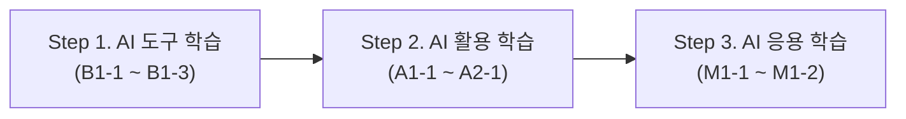

# 🚀 Codyssey AI 학습 및 프로젝트 아카이브

Codyssey AI 교육과정의 실습 산출물 및 과제 프로젝트를 체계적으로 정리한 아카이브 저장소입니다.  
**기초 도구 학습(B) ➡️ 실무 활용 학습(A) ➡️ 심화 응용 학습(M)** 순서로 커리큘럼이 구성되어 있습니다.

---

## 🧭 커리큘럼 로드맵 (Curriculum Roadmap)

---

### 📌 1단계. AI 도구 학습 (Basic Tools)
AI 도구의 특성을 이해하고 업무 및 분석에 도구를 효과적으로 도입하는 단계입니다.

| 과제 코드 | 과제명 / 주제 | 주요 산출물 | 바로가기 |
|:---:|---|---|:---:|
| **B1-1** | LLM 모델 비교 및 회의록 분석 | 시스템 설계 문서, LLM 비교 보고서, AI 요약문 | [이동](./AI%20도구%20학습%20B1-1) |
| **B1-2** | 멀티모달 스토리보드 제작 | 장면별 이미지 생성, 영상 시나리오 기획서 | [이동](./AI%20도구%20학습%20B1-2) |
| **B1-3** | 업무 자동화 및 워크플로우 설계 | 자유 주제 자동화 파이프라인, 비교 분석 보고서 | [이동](./AI%20도구%20학습%20B1-3) |

---

### 📌 2단계. AI 활용 학습 (Applied Engineering)
API와 파이썬 프로그래밍을 결합하여 실질적인 AI 애플리케이션을 구축하는 단계입니다.

| 과제 코드 | 과제명 / 주제 | 주요 기술 스택 | 바로가기 |
|:---:|---|---|:---:|
| **A1-1** | 프롬프트 매니저 (Prompt Manager) | Python, JSON, CLI, Pytest | [이동](./AI%20활용%20학습%20A1-1) |
| **A1-2** | 맞춤형 국내 여행 플래너 | Gemini API, Kakao Local API, Markdown 리포트 | [이동](./AI%20활용%20학습%20A1-2) |
| **A1-3** | 인터랙티브 웹 코칭 서비스 (온기록) | HTML/CSS/JS, FastAPI, Vercel 배포 | [이동](./AI%20활용%20학습%20A1-3) |
| **A2-1** | 멀티모달 AI 로고 생성기 & 컬러 팔레트 | LLM Prompting, Image Generation | [이동](./AI%20활용%20학습%20A2-1) |

---

### 📌 3단계. AI 응용 학습 (Advanced Analytics & Agent)
데이터 분석과 에이전트 아키텍처를 통해 인사이트를 도출하고 서비스를 고도화하는 단계입니다.

| 과제 코드 | 과제명 / 주제 | 주요 내용 / 기술 스택 | 바로가기 |
|:---:|---|---|:---:|
| **M1-1** | 데이터 기반 트렌드 분석 | 시계열 데이터 분석(환율), 이동평균, REPORT.md | [이동](./AI%20응용%20학습%20M1-1) |
| **M1-2** | 나만의 AI 비서 구축 (AI Agent) | Gemini API, FastAPI, Firestore, 분산 배포 *(준비 중)* | [이동](./AI%20응용%20학습%20M1-2) |

---

## 🛠️ 실행 환경 및 공통 안내
* **언어**: Python 3.10+
* 각 과제 폴더 내의 `README.md` 또는 `REPORT.md`를 통해 세부 실행 방법과 재현 절차를 확인하실 수 있습니다.
